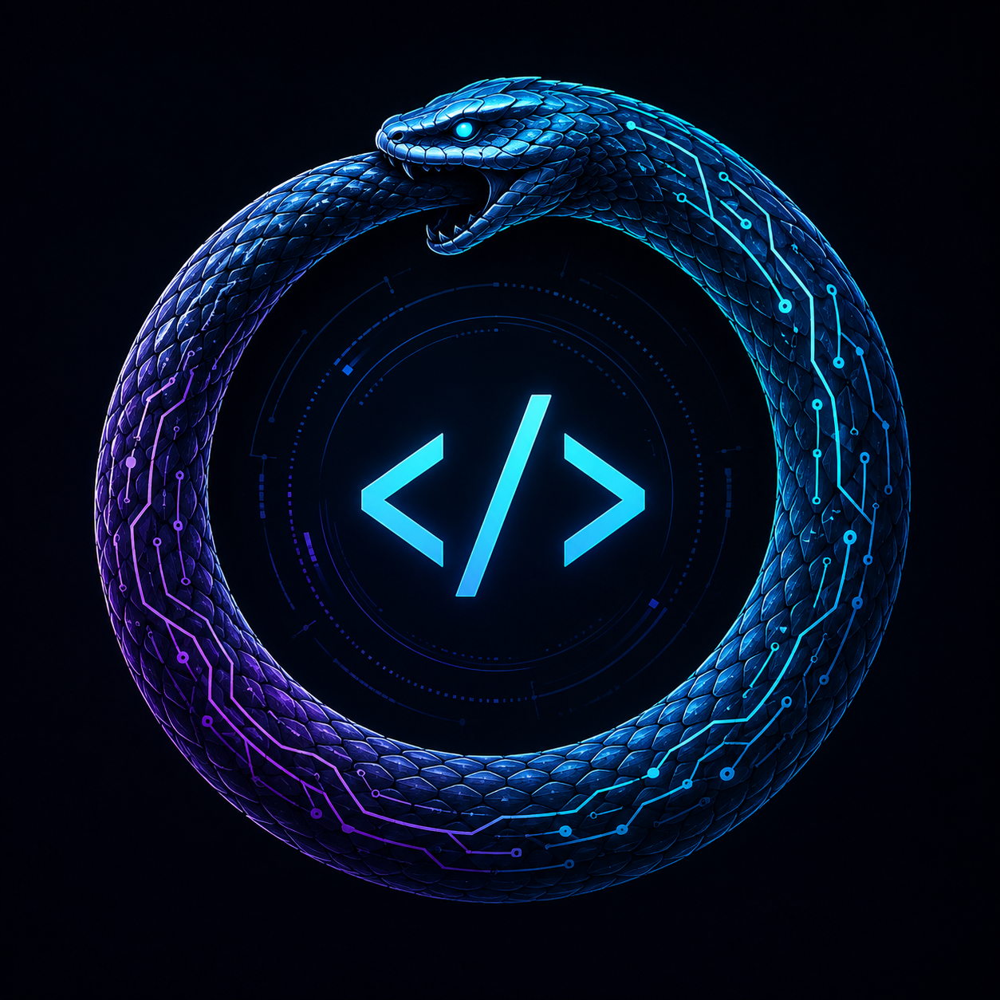

# Ouroboros

  

Projeto pessoal de estudos em C#/.NET, sem fim por design — assim como o ouroboros, a cobra que come o próprio rabo em loop infinito, este projeto nunca é considerado "terminado", apenas continuamente revisitado e evoluído.

## Objetivo

Construir e refinar, ao longo do tempo, o backend de um e-commerce, servindo como terreno de prática para:

- Clean Architecture
- Domain-Driven Design (DDD)
- Docker
- Segurança de aplicações
- E outros conceitos que forem surgindo pelo caminho

## Branches

- `main` — versão estável.
- `development` — desenvolvimento ativo.
